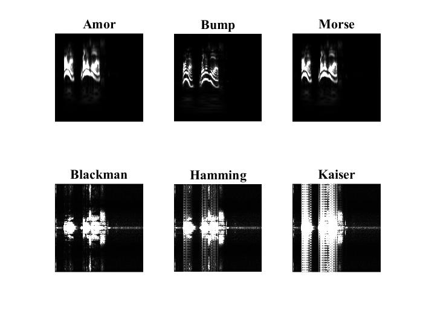

# Clasificacion-y-Clonacion-de-voz
En este repositorio proporcionamos la información esencial como datasets y códigos utilizados para realizar clasificación y clonación de la voz.

## Clasificacion
Se planteo realizar el proceso de clasificacion entre varias personas utilizando las imagenes del espectro en tiempo frecuencia de su voz, estas imagenes se obtuviron para 6 transformadas, STFT: Hamming, Blackman, Kaiser y CWT: Bump, Morse, Amor. Este proceso se realizo en el entorno de programacion MATLAB, los parametros y codigo en general se encuentran en el archivo llamado https://github.com/duvanpantoja/Clasificacion-y-Clonacion-de-voz/blob/main/Transformadas_Audios_clasificacion.m con el cual se obtiene la imagen de cada transformada.

Posterior a esto se aplica una tecnica llamada Transfer-Learning que consiste en tomar modelos pre-entrenados y adaptarlos a los problemas de clasificacion especificos que se necesite, puedes acceder a estos modelos proporcionados por Keras en Python.

El codigo para adaptar y entrenar estos modelos es https://github.com/duvanpantoja/Clasificacion-y-Clonacion-de-voz/blob/main/Transferencia_de_Conocimiento.py, se utilizaron las siguientes arquitecturas:

* ResNet152
* InceptionV3
* InceptionResNetV2
* DenseNet201
* Xception
* ResNet101
* MobileNet
* MobileNetV2 
* NasNetMobile
* EfficientNetB0
* EfficientNetB3
* EfficientNetB7

Si quieres graficar los resultados, el codigo en MATLAB https://github.com/duvanpantoja/Clasificacion-y-Clonacion-de-voz/blob/main/Graficas.m contiene un ejemplo. 

## Clonacion

