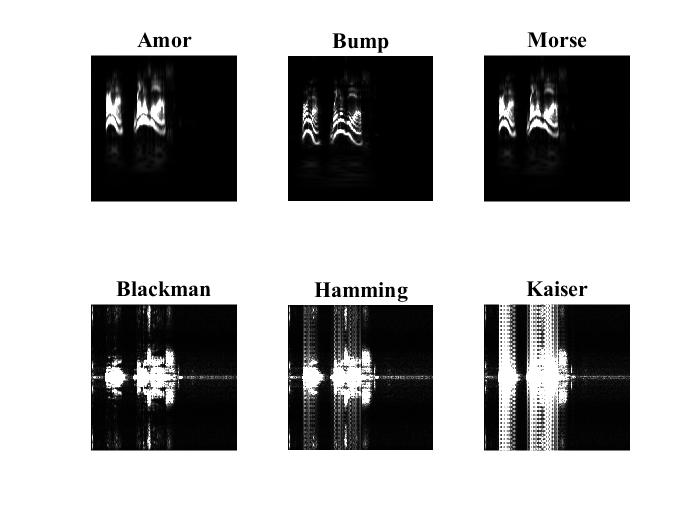
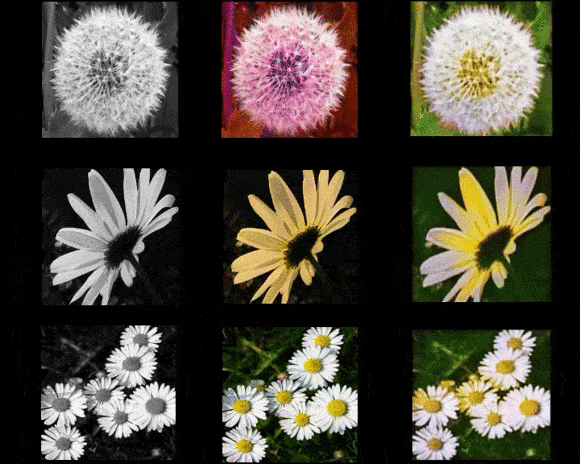
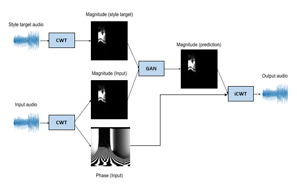

# Clasificación-y-Clonación-de-voz
En este repositorio proporcionamos la información esencial como datasets y códigos utilizados para realizar clasificación y clonación de la voz.

## Clasificación
Se planteo realizar el proceso de clasificación entre varias personas utilizando las imágenes del espectro en tiempo frecuencia de su voz, estas imágenes se obtuvieron para 6 transformadas, STFT: Hamming, Blackman, Kaiser y CWT: Bump, Morse, Amor. Este proceso se realizó en el entorno de programación MATLAB, los parámetros y código en general se encuentran en el archivo llamado https://github.com/duvanpantoja/Clasificacion-y-Clonacion-de-voz/blob/main/Transformadas_Audios_clasificacion.m con el cual se obtiene la imagen de cada transformada.

Posterior a esto se aplica una técnica llamada Transfer-Learning que consiste en tomar modelos pre-entrenados y adaptarlos a los problemas de clasificación específicos que se necesite, puedes acceder a estos modelos proporcionados por Keras en Python.

El código para adaptar y entrenar estos modelos es https://github.com/duvanpantoja/Clasificacion-y-Clonacion-de-voz/blob/main/Transferencia_de_Conocimiento.py, se utilizaron las siguientes arquitecturas:

* ResNet152
* InceptionV3
* InceptionResNetV2
* DenseNet201
* Xception
* ResNet101
* MobileNet
* MobileNetV2 
* NasNetMobile
* EfficientNetB0
* EfficientNetB3
* EfficientNetB7

Si quieres graficar los resultados, el código en MATLAB https://github.com/duvanpantoja/Clasificacion-y-Clonacion-de-voz/blob/main/Graficas.m contiene un ejemplo. 

## Clonación
Para el proceso de clonación se utilizó Redes Generativas Adversarias (GAN) la cual es capaz de aprender a crear contenido dependiendo de cómo haya sido entrenada, en el siguiente ejemplo se entrenó una de estas Redes para crear una imagen a color a partir de una imagen blanco y negro.

La primera columna son las imagenes de entrada a blanco y negro, la segunda columna contiene las imagenes a las que se desea llegar y en la tercera columna son las imagenes que la red GAN genero.
Para el clonado de voz se utilizo la misma metodologia pero la diferencia radica en que se ingreso el espectro de voz de un hablante de entrada para que la rede genere el espectro de voz de un hablante objetivo. 

